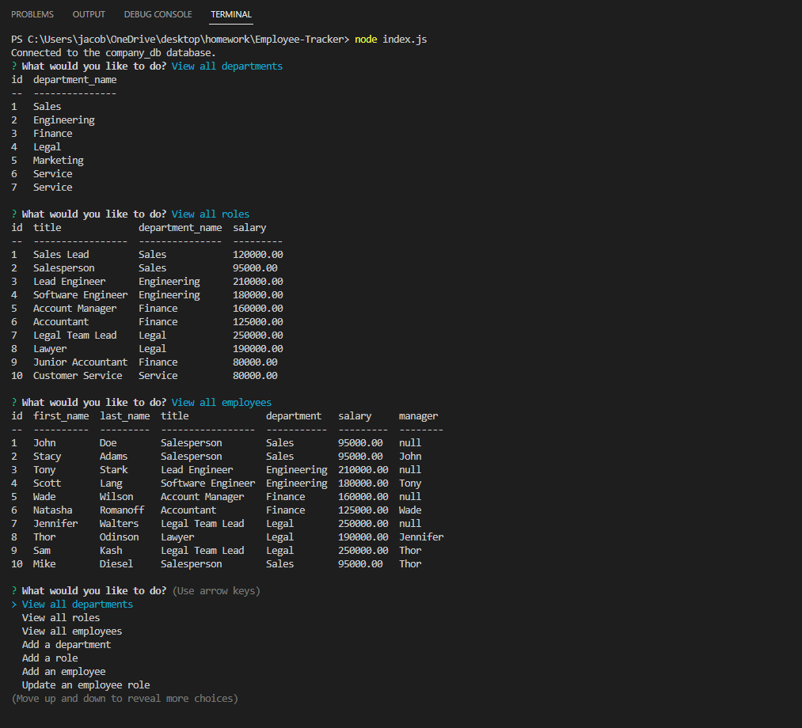

# Employee Tracker

## Description

A content management system (CMS) interface built in the command line application. Built using Node.js, Inquirer npm and MySQL.

View a walkthrough video through [this link](https://drive.google.com/file/d/1t4hHrdtT5rALhNQChNyF6Rq0ACji0_N5/view).

## Table of Contents

- [Installation](#installation)
- [Usage](#usage)
- [Credits](#credits)
- [License](#license)
- [Contributing](#contributing)
- [Questions](#questions)
- [Tests](#tests)

## Installation

npm install

## Usage

Use this application to easily view and interact with information stored in databases.

## Credits

undefined

## Contributing

Contact me

## Questions

Please contact me via the following methods.

- Github: [JCaloca](https://github.com/JCaloca)

## Tests

none
